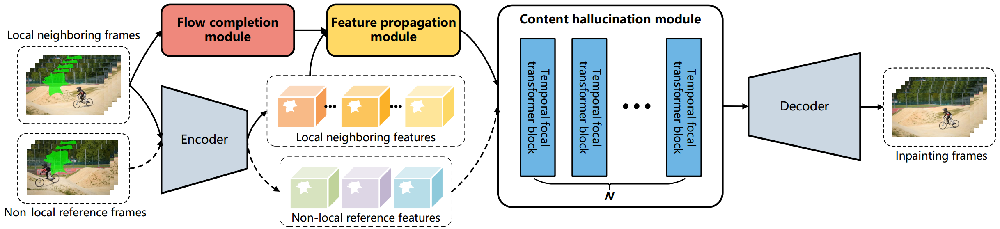
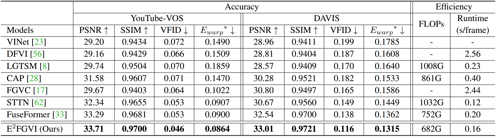

# E<sup>2</sup>FGVI (CVPR 2022)
[](https://paperswithcode.com/sota/video-inpainting-on-davis?p=towards-an-end-to-end-framework-for-flow)
[](https://paperswithcode.com/sota/video-inpainting-on-youtube-vos?p=towards-an-end-to-end-framework-for-flow)


English | [简体中文](README_zh-CN.md)

This repository contains the official implementation of the following paper:
> **Towards An End-to-End Framework for Flow-Guided Video Inpainting**<br>
> Zhen Li<sup>#</sup>, Cheng-Ze Lu<sup>#</sup>, Jianhua Qin, Chun-Le Guo<sup>*</sup>, Ming-Ming Cheng<br>
> IEEE/CVF Conference on Computer Vision and Pattern Recognition (**CVPR**), 2022<br>

[[Paper](https://arxiv.org/abs/2204.02663)]
[[Demo Video (Youtube)](https://www.youtube.com/watch?v=N--qC3T2wc4)]
[[演示视频 (B站)](https://www.bilibili.com/video/BV1Ta411n7eH?spm_id_from=333.999.0.0)]
[Project Page (TBD)]
[Poster (TBD)]

You can try our colab demo here: [](https://colab.research.google.com/drive/12rwY2gtG8jVWlNx9pjmmM8uGmh5ue18G?usp=sharing)

## :star: News
- *2022.05.15:* We release E<sup>2</sup>FGVI-HQ, which can handle videos with **arbitrary resolution**. This model could generalize well to much higher resolutions, while it only used 432x240 videos for training. Besides, it performs **better** than our original model on both PSNR and SSIM metrics. 
:link: Download links: [[Google Drive](https://drive.google.com/file/d/10wGdKSUOie0XmCr8SQ2A2FeDe-mfn5w3/view?usp=sharing)] [[Baidu Disk](https://pan.baidu.com/s/1jfm1oFU1eIy-IRfuHP8YXw?pwd=ssb3)] :movie_camera: Demo video: [[Youtube](https://www.youtube.com/watch?v=N--qC3T2wc4)] [[B站](https://www.bilibili.com/video/BV1Ta411n7eH?spm_id_from=333.999.0.0)]

- *2022.04.06:* Our code is publicly available.
## Demo


### More examples (click for details):

<table>
<tr>
   <td> 
      <details> 
      <summary> 
      <strong>Coco (click me)</strong>
      </summary> 
      
      </details>
   </td>
   <td> 
      <details> 
      <summary> 
      <strong>Tennis </strong>
      </summary> 
      
      </details>
   </td>
</tr>
<tr>
   <td> 
      <details> 
      <summary> 
      <strong>Space </strong>
      </summary> 
      
      </details>
   </td>
   <td> 
      <details> 
      <summary> 
      <strong>Motocross </strong>
      </summary> 
      
      </details>
   </td>
</tr>
</table>

## Overview


### :rocket: Highlights:
- **SOTA performance**: The proposed E<sup>2</sup>FGVI achieves significant improvements on all quantitative metrics in comparison with SOTA methods.
- **Highly effiency**: Our method processes 432 × 240 videos at 0.12 seconds per frame on a Titan XP GPU, which is nearly 15× faster than previous flow-based methods. Besides, our method has the lowest FLOPs among all compared SOTA
methods.

## Work in Progress
- [ ] Update website page
- [ ] Hugging Face demo
- [ ] Efficient inference

## Dependencies and Installation

1. Clone Repo

   ```bash
   git clone https://github.com/MCG-NKU/E2FGVI.git
   ```

2. Create Conda Environment and Install Dependencies

   ```bash
   conda env create -f environment.yml
   conda activate e2fgvi
   ```
   - Python >= 3.7
   - PyTorch >= 1.5
   - CUDA >= 9.2
   - [mmcv-full](https://github.com/open-mmlab/mmcv#installation) (following the pipeline to install)

   If the `environment.yml` file does not work for you, please follow [this issue](https://github.com/MCG-NKU/E2FGVI/issues/3) to solve the problem.

## Get Started
### Prepare pretrained models
Before performing the following steps, please download our pretrained model first.

<table>
<thead>
  <tr>
    <th>Model</th>
    <th>:link: Download Links </th>
    <th>Support Arbitrary Resolution ?</th>
    <th> PSNR / SSIM / VFID (DAVIS) </th>
  </tr>
</thead>
<tbody>
  <tr>
    <td>E<sup>2</sup>FGVI</td>
    <th>
       [<a href="https://drive.google.com/file/d/1tNJMTJ2gmWdIXJoHVi5-H504uImUiJW9/view?usp=sharing">Google Drive</a>] 
       [<a href="https://pan.baidu.com/s/1qXAErbilY_n_Fh9KB8UF7w?pwd=lsjw">Baidu Disk</a>]
    </th>
    <th>:x:</th>
    <th>33.01 / 0.9721 / 0.116</th>
  </tr>
  <tr>
    <td>E<sup>2</sup>FGVI-HQ</td>
    <th>
       [<a href="https://drive.google.com/file/d/10wGdKSUOie0XmCr8SQ2A2FeDe-mfn5w3/view?usp=sharing">Google Drive</a>] 
       [<a href="https://pan.baidu.com/s/1jfm1oFU1eIy-IRfuHP8YXw?pwd=ssb3">Baidu Disk</a>]
    </th>
    <th>:o:</th>
    <th>33.06 / 0.9722 / 0.117</th>
  </tr>
</tbody>
</table>

Then, unzip the file and place the models to `release_model` directory.

The directory structure will be arranged as:
```
release_model
   |- E2FGVI-CVPR22.pth
   |- E2FGVI-HQ-CVPR22.pth
   |- i3d_rgb_imagenet.pt (for evaluating VFID metric)
   |- README.md
```

### Quick test
We provide two examples in the [`examples`](./examples) directory.

Run the following command to enjoy them:
```shell
# The first example (using split video frames)
python test.py --model e2fgvi (or e2fgvi_hq) --video examples/tennis --mask examples/tennis_mask  --ckpt release_model/E2FGVI-CVPR22.pth (or release_model/E2FGVI-HQ-CVPR22.pth)
# The second example (using mp4 format video)
python test.py --model e2fgvi (or e2fgvi_hq) --video examples/schoolgirls.mp4 --mask examples/schoolgirls_mask  --ckpt release_model/E2FGVI-CVPR22.pth (or release_model/E2FGVI-HQ-CVPR22.pth)
```
The inpainting video will be saved in the `results` directory.
Please prepare your own **mp4 video** (or **split frames**) and **frame-wise masks** if you want to test more cases.

*Note:* E<sup>2</sup>FGVI always rescales the input video to a fixed resolution (432x240), while E<sup>2</sup>FGVI-HQ does not change the resolution of the input video. If you want to custom the output resolution, please use the `--set_size` flag and set the values of `--width` and `--height`.

Example:
```shell
# Using this command to output a 720p video
python test.py --model e2fgvi_hq --video <video_path> --mask <mask_path>  --ckpt release_model/E2FGVI-HQ-CVPR22.pth --set_size --width 1280 --height 720
```


### Prepare dataset for training and evaluation
<table>
<thead>
  <tr>
    <th>Dataset</th>
    <th>YouTube-VOS</th>
    <th>DAVIS</th>
  </tr>
</thead>
<tbody>
  <tr>
    <td>Details</td>
    <td>For training (3,471) and evaluation (508)</td>
    <td>For evaluation (50 in 90)</td>
  <tr>
    <td>Images</td>
    <td> [<a href="https://competitions.codalab.org/competitions/19544#participate-get-data">Official Link</a>] (Download train and test all frames) </td>
    <td> [<a href="https://data.vision.ee.ethz.ch/csergi/share/davis/DAVIS-2017-trainval-480p.zip">Official Link</a>] (2017, 480p, TrainVal) </td>
  </tr>
  <tr>
    <td>Masks</td>
    <td colspan="2"> [<a href="https://drive.google.com/file/d/1dFTneS_zaJAHjglxU10gYzr1-xALgHa4/view?usp=sharing">Google Drive</a>] [<a href="https://pan.baidu.com/s/1JC-UKmlQfjhVtD81196cxA?pwd=87e3">Baidu Disk</a>] (For reproducing paper results) </td>
  </tr>
</tbody>
</table>

The training and test split files are provided in `datasets/<dataset_name>`.

For each dataset, you should place `JPEGImages` to `datasets/<dataset_name>`.

Then, run `sh datasets/zip_dir.sh` (**Note**: please edit the folder path accordingly) for compressing each video in `datasets/<dataset_name>/JPEGImages`.

Unzip downloaded mask files to `datasets`.

The `datasets` directory structure will be arranged as: (**Note**: please check it carefully)
```
datasets
   |- davis
      |- JPEGImages
         |- <video_name>.zip
         |- <video_name>.zip
      |- test_masks
         |- <video_name>
            |- 00000.png
            |- 00001.png   
      |- train.json
      |- test.json
   |- youtube-vos
      |- JPEGImages
         |- <video_id>.zip
         |- <video_id>.zip
      |- test_masks
         |- <video_id>
            |- 00000.png
            |- 00001.png
      |- train.json
      |- test.json   
   |- zip_file.sh
```
### Evaluation
Run one of the following commands for evaluation:
```shell
 # For evaluating E2FGVI model
 python evaluate.py --model e2fgvi --dataset <dataset_name> --data_root datasets/ --ckpt release_model/E2FGVI-CVPR22.pth
 # For evaluating E2FGVI-HQ model
 python evaluate.py --model e2fgvi_hq --dataset <dataset_name> --data_root datasets/ --ckpt release_model/E2FGVI-HQ-CVPR22.pth

```
You will get scores as paper reported if you evaluate E<sup>2</sup>FGVI.
The scores of E<sup>2</sup>FGVI-HQ can be found in [[Prepare pretrained models](https://github.com/MCG-NKU/E2FGVI#prepare-pretrained-models)].

The scores will also be saved in the `results/<model_name>_<dataset_name>` directory.

Please `--save_results` for further [evaluating temporal warping error](https://github.com/phoenix104104/fast_blind_video_consistency#evaluation).

### Training
Our training configures are provided in [`train_e2fgvi.json`](./configs/train_e2fgvi.json) (for E<sup>2</sup>FGVI) and [`train_e2fgvi_hq.json`](./configs/train_e2fgvi_hq.json) (for E<sup>2</sup>FGVI-HQ).

Run one of the following commands for training:
```shell
 # For training E2FGVI
 python train.py -c configs/train_e2fgvi.json
 # For training E2FGVI-HQ
 python train.py -c configs/train_e2fgvi_hq.json
```
You could run the same command if you want to resume your training.

The training loss can be monitored by running:
```shell
tensorboard --logdir release_model                                                   
```

You could follow [this pipeline](https://github.com/MCG-NKU/E2FGVI#evaluation) to evaluate your model.
## Results  

### Quantitative results

## Citation

   If you find our repo useful for your research, please consider citing our paper:

   ```bibtex
   @inproceedings{liCvpr22vInpainting,
      title={Towards An End-to-End Framework for Flow-Guided Video Inpainting},
      author={Li, Zhen and Lu, Cheng-Ze and Qin, Jianhua and Guo, Chun-Le and Cheng, Ming-Ming},
      booktitle={IEEE Conference on Computer Vision and Pattern Recognition (CVPR)},
      year={2022}
   }
   ```
## Contact

If you have any question, please feel free to contact us via `zhenli1031ATgmail.com` or `czlu919AToutlook.com`.

## License
Licensed under a [Creative Commons Attribution-NonCommercial 4.0 International](https://creativecommons.org/licenses/by-nc/4.0/) for Non-commercial use only.
Any commercial use should get formal permission first.

## Acknowledgement

This repository is maintained by [Zhen Li](https://paper99.github.io) and [Cheng-Ze Lu](https://github.com/LGYoung).

This code is based on [STTN](https://github.com/researchmm/STTN), [FuseFormer](https://github.com/ruiliu-ai/FuseFormer), [Focal-Transformer](https://github.com/microsoft/Focal-Transformer), and [MMEditing](https://github.com/open-mmlab/mmediting).
